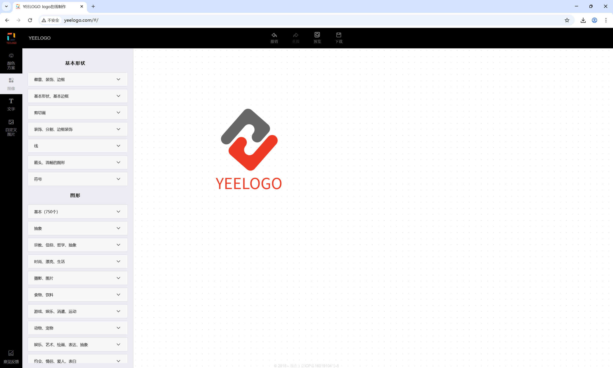

# 推荐几款软件开发辅助工具

开发人员在软件开发过程中，总会遇到各式各样的问题，系统的、网络的、开发集成环境的等等不一而足，有时会为这些问题浪费不少开发时间和精力，感到颇为头疼，但有些问题已经是有现成的工具可以解决的。下面推荐几款本人在开发过程中用到的辅助软件开发的工具，也欢迎大家补充各种工具，毕竟个人所知有限，如能集思广益，定能开拓视野，提升开发效率！

当然，这里主要介绍那些开发者小众工具或者说不是广为人（开发者）知且好用的工具，像JetBrains家族的IDEA/PyCharm/PHPStorm/WebStorm、微软的VSCode等这些比较知名的工具，这里就不列举了。

这里先按软件形式简单分几个大类：

## 一、PC软件工具

### 1、dev-sidecar

这里**重点推荐**这个【dev-sidecar】开发者边车，这个工具主要用于GitHub、NPM加速等。我们在开发过程中经常需要访问GitHub一些开源软件或开源代码库、资料等，在访问GitHub时如果不借助代理等其他手段的情况下，网络时好时坏，相当不稳定。而通过dev-sidecar可以稳定的访问GitHub等，实在是开发者的福音。

> dev-sidecar支持Windows、MacOS、Linux等平台

其软件界面参考如下：


> 下载地址：<https://github.com/docmirror/dev-sidecar/releases>

```shell
PS：
不过使用这个软件有个要注意的地方，就是如果关机时未关掉软件，重启电脑后，如果不打开此软件，会导致无法上网。
原因是在未退出软件就关机时，软件修改了本地代理，但关机时又把代理服务给关掉了，所以重启后无法上网。
解决办法就是重启后打开此软件或在关机前先退出关闭该软件。
其实如果有细心留意，软件界面上有提醒。
```

### 2、FlyEnv

这里也**安利**一款开发利器：FlyEnv。FlyEnv 是一款专为现代开发者设计的一体化环境管理工具。其通过多版本切换、全栈技术支持、无缝跨平台体验，简化安装配置等开发流程。其前身虽是PHPStudy，目前FleyEnv已支持Java、PHP、Python、Go、NodeJS等语言，MySQL、MariaDB、PostgreSQL、MongoDB等数据库，Redis、RabbitMQ、ElasticSearch等中间件，Apache、Nginx、Tomcat、Consul、Minio等服务。

> FlyEnv支持Windows、MacOS、Linux等平台

其软件界面如下：


> 下载地址：<https://flyenv.com/>

### 3、SwitchHosts

在网络开发和系统运维工作中，经常需要修改Hosts文件来实现本地开发调试、网络测试或访问限制等需求。比如开发人员调试网站时，需要将域名指向本地服务。然而，直接编辑系统Hosts文件存在诸多不便：操作繁琐、容易出错、难以快速切换不同配置、多台电脑上维护相同Hosts同步困难、手动修改Hosts又需要管理员权限。这就是SwitchHosts的价值所在：修改、管理、切换多个 hosts，它让Hosts管理变得简单、高效。

> SwitchHosts支持Windows、MacOS、Linux等平台

其软件界面参考如下：


> 下载地址：<https://github.com/oldj/SwitchHosts/releases>

## 二、在线工具

### 1、ProccessOn

ProcessOn是一个在线流程图思维导图工具，一个专业强大的作图工具，支持多人实时在线协作，可用于甘特图、ER图、UML、网络拓扑图、鱼骨图、组织结构图等多种图形绘制。个人认为ProccessOn的优点主要在于其有海量的模板和其简单易用性。

其Web界面如下：


> 在线地址：<https://www.processon.com/>

### 2、YEELOGO

YEELOGO是一款完全免费的logo设计工具，它的界面比较简洁，没有多余的东西，直接进入正题，工具提供了大量的免费素材可供使用，也可以上传本地素材，并且对素材进行了详细的分类方便查找。

其Web界面如下：



> 在线地址：<http://www.yeelogo.com/>

### 3、uutool

uutool（UU在线工具）是一个便捷实用的工具集合站。
uutool提供数百款便捷实用的在线工具，覆盖文本处理、图像编辑、编程辅助、音视频处理等多个领域，无需注册登录及下载，即开即用，轻松应对各种日常数据处理需求。其支持Base64编码解码、JS代码美化压缩、CSS代码美化压缩、JSON格式化、时间戳转换、RGB颜色转换等功能。

其Web界面如下：


> 在线地址：<https://uutool.cn/>

## 三、插件

### 1、PlantUML

PlantUML是一款开源工具，支持通过简单的文本描述语言来创建各种UML图。它的主要目标是帮助软件开发团队更高效地创建和维护系统文档，通过代码化的方式管理UML图，使图表与代码保持同步。PlantUML支持Eclipse、IDEA、VSCode等。

> 插件地址：<https://plantuml.com/zh/>

### 2、SonarLint

SonarLint是一个强大的代码质量检测工具，它可以帮助开发者在编码过程中即时发现并修复潜在的缺陷和代码异味。SonarLint支持多种编程语言，并且与多种集成开发环境（IDE）集成，如IDEA、Eclipse、VSCode等。

> 可在各个IDE时面的插件市场搜索安装

```shell
IDEA插件地址：https://github.com/SonarSource/sonarlint-intellij
Eclipse插件地址：https://github.com/SonarSource/sonarlint-eclipse/releases
VSCode插件地址：https://github.com/SonarSource/sonarlint-vscode
```

码字不易，先介绍到这，后面有用到或想到其他工具再补充。
